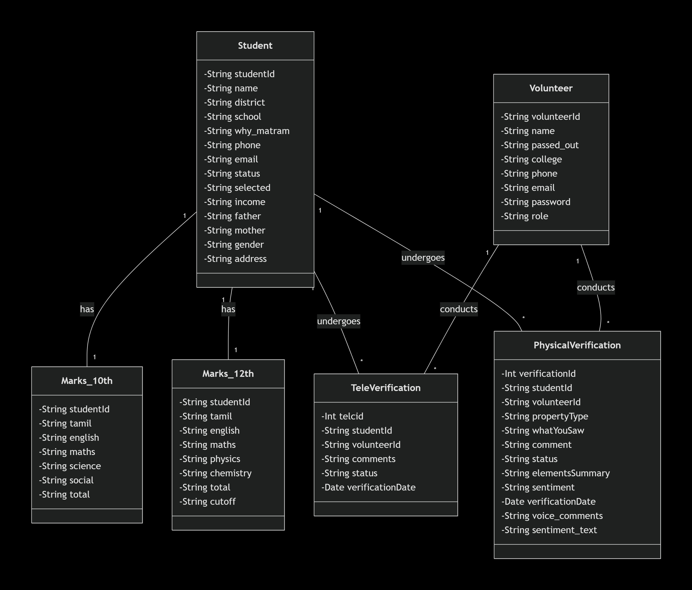

# 🤖 AI-Powered PV Verification System (Voice Comment Sentiment Analysis)

## 💡 Project Overview

This project is an AI-enabled Physical Verification (PV) System designed for scholarship programs. It helps volunteers collect structured information about students' family, household, financial status, and general background. The system supports text comments and voice-based comments, which are automatically analyzed using AI.

The core innovation is:
> **Automated Sentiment Analysis on Voice Comments using the Gemini API.**

## 🎯 The Challenge (Problem Statement)

Traditional Physical Verification reports suffer from significant bottlenecks:

* **🗣️ Unstructured Data:** Volunteers submit highly inconsistent, free-form text and voice comments.
* **⏱️ Manual Overload:** Reviewers must manually listen to long voice notes and analyze lengthy text, leading to delays.
* **🌐 Language Barrier:** Difficulty in processing **Tanglish (Tamil + English mixed-language) comments**.
* **⚠️ Inconsistent Outcomes:** Lack of standardized data makes final 'Select/Reject' decisions subjective and inconsistent.

## ✨ The Solution (AI-Driven Pipeline)

Our system introduces an automated, high-throughput verification pipeline powered by the Gemini API:

| Step | Feature | AI/Tech Used |
| :--- | :--- | :--- |
| **1. Capture** | Structured Comment Form + Voice Recording | Frontend |
| **2. Translation** | Converts **Tanglish/** inputs to standard English. | Gemini API |
| **3. Transcription** | **Transcribes** voice recordings automatically. | Gemini API |
| **4. Analysis** | Performs **Sentiment Analysis** on the combined voice/text comment. | Gemini API |
| **5. Summary** | Generates **clean, concise English summaries** of the verification. | Custom Summarizer |
| **6. Recommendation** | Provides an **AI-based recommendation** (Select / On Hold / Reject) for the reviewer. | Custom Logic + Gemini |
| **7. Storage** | Saves all raw data, AI outputs, and final recommendations to **MySQL**. | Backend |

## ⚙️ Tech Stack

### 💻 Frontend
* **HTML, CSS, JavaScript**

### 🐍 Backend
* **Python Flask** (Lightweight web framework)
* **Background Async Pipeline** (To handle long-running AI processing without blocking the UI)

### 🧠 AI / ML
* **Gemini API** (Used for core **Translation**, **Transcription**, and **Sentiment Analysis**)\
* **LangGraph** (For building the AI agent workflow)

### 🗃️ Database
* **MySQL** (To store student details and the comprehensive PhysicalVerification reports)

## Class diagram

## 🎬 Demo Video 

